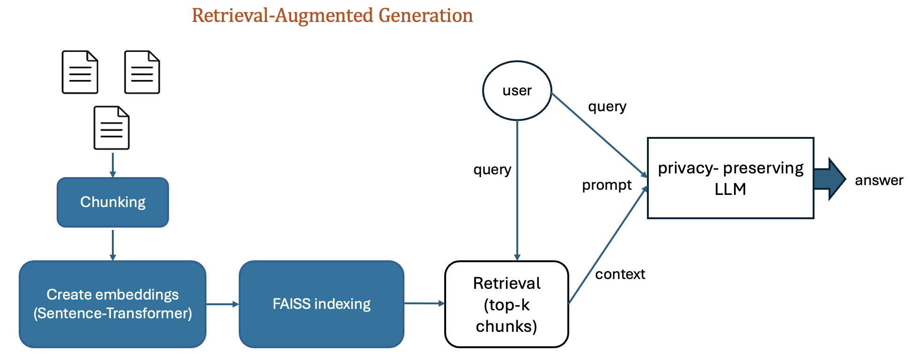

# DocuQuery-RAG: A Retrieval-Augmented Generation System for Enterprise Document Q&A
This project demonstrates how **RAG (Retrieval-Augmented Generation)** can be applied to organizational knowledge management.
Employees or researchers can ask natural language questions, and the system retrieves relevant passages from company documents (PDFs, manuals, policies, reports) before generating a grounded answer with an LLM.
The framework is domain-agnostic and can be adapted for research labs, HR policies, financial reports, or technical manuals.


---

## Overview

Traditional LLMs rely solely on pre-trained knowledge, often hallucinating when asked about specific company or project data. **DocuQuery-RAG** solves this by integrating an intelligent retrieval pipeline that fetches relevant document chunks before generation.  

---

## System Components

- **1️⃣ Document Embedding & Indexing**  
  - Uses `SentenceTransformers (all-MiniLM-L6-v2)` for text embeddings.  
  - Stores document vectors efficiently using **FAISS** for similarity search.

- **2️⃣ Retrieval & Re-Ranking**  
  - Retrieves top-k relevant passages for a user query.  
  - Optionally re-ranks them using a **CrossEncoder** for improved contextual precision.

- **3️⃣ LLM Response Generation (LLaMA)**  
  - Uses **Meta-LLaMA 3–8B** as the answering model.  
  - The system builds a structured prompt combining retrieved context + query.  

- **4️⃣ Output Formatting**  
  - Answers are generated in full sentences.  
  - Long outputs are neatly wrapped to maintain readability in Colab or console.

---

## Project Structure

```
RAG-system/
 │
 ├── DocuQuery_RAG.ipynb # Main Colab notebook (RAG vs. LLM-only generation)
 ├── requirements.txt # (optional) List of dependencies
 └── README.md # Project overview and setup guide
```
---

## 💻 Running the Notebook

1. Open the notebook in Google Colab.  
2. Mount Google Drive (if using external PDFs).  
3. Install dependencies:
   ```bash
   !pip install faiss-cpu sentence-transformers transformers accelerate huggingface_hub
   
4. Authenticate with Hugging Face Hub

- Visit https://huggingface.co/settings/tokens
- Create a new access token (at least “Read” permission).
- Log in inside the notebook using:
  ```python
    from huggingface_hub import login
    login(token="your-HF-token")
  ```
5. Run all cells in order to build the index and interact with the RAG system.


